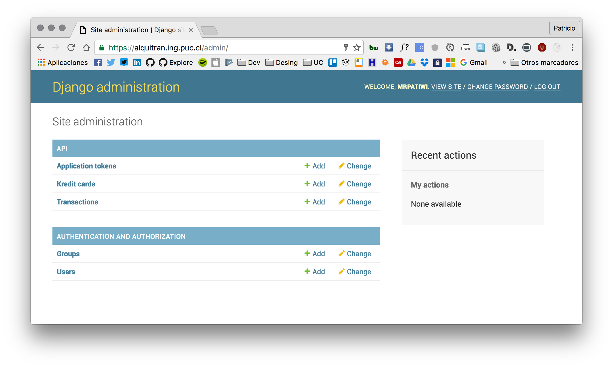

# Alquitrán Web Payments © REST API

> Built with Python 3.5 and Django :snake:

[](https://travis-ci.org/IIC2173-2016-2/arquitran)



[API documentation](https://jsapi.apiary.io/previews/arquitranpaymentapi) | [Running instance](https://alquitran.ing.puc.cl)

## Development

Clone this repository:

```sh
git clone https://github.com/IIC2173-2016-2/arquitran.git
cd arquitran
```

### Prepare virtualenv:

```sh
pip install -U virtualenv
virtualenv --python=python3.5 arquitranenv
source ./arquitranenv/bin/activate

# To stop using this virtualenv:
deactivate
```

Install dependencies:

```sh
pip install -r requirements.txt
```

### Setup Postgres database:

Open the Postgres interactive command line:

```sh
psql
```

Create the user, database and grant him permissions:

```sql
CREATE DATABASE arquitran;
CREATE USER arquitranuser WITH PASSWORD 'password';
ALTER USER arquitranuser CREATEDB;
GRANT ALL PRIVILEGES ON DATABASE arquitran TO arquitranuser;
```

Make migrations:

```
python manage.py migrate
```

### Run server

Start the app at [`http://localhost:8000/`](http://localhost:8000/) with:

```sh
python manage.py runserver
```

## Production

> Make sure you have Docker and Docker-compose installed.

Create Docker volume:

```sh
docker volume create --name=alquitran-data
```

Setup environment variables:

```sh
# Keep this secret
export POSTGRES_PASSWORD=SECRET_AND_LONG_HASH
export SECRET_KEY=SECRET_AND_LONG_HASH
```

Run Docker-compose:

```sh
docker-compose up -d
```

Run migrations:

```sh
docker-compose exec django python manage.py migrate
```

Create super user:

```sh
docker-compose exec django python manage.py createsuperuser --username=admin --email=admin@example.com
```

Update app with short downtime:

```sh
docker-compose up -d --build
```

## Testing

Run the test suite with:

```sh
python manage.py test
```
